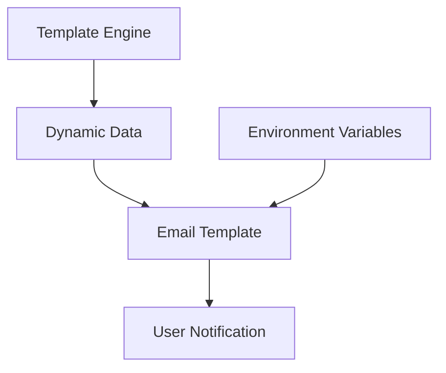
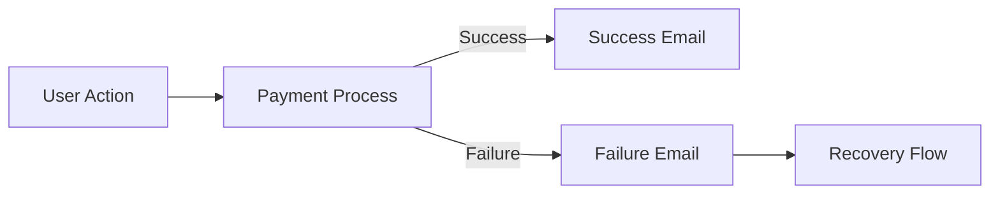

# System Patterns

## Architecture Overview

The system follows a server-side rendered approach with modular components:

### Core Components

1. Payment Processing System
2. Email Notification Service
3. User Management System
4. Order Tracking System

## Design Patterns

### Email Template System

- **Template Engine**: EJS (Embedded JavaScript)
- **Location**: `server/templates/`
- **Pattern**: Server-side rendering with dynamic data injection
- **Naming Convention**: Descriptive names (e.g., `paymentfailure.ejs`)

### Configuration Management

- **Pattern**: Environment-based configuration
- **Implementation**: `process.env` variables for:
  - Brand information (BRAND_NAME, BRAND_LOGO_IMAGE_URL)
  - System URLs (BRAND_WEBSITE)
  - Support contact (SUPPORT_EMAIL)

### Navigation Structure

- **Pattern**: User-centric routing
- **Base Path**: `/user/` for user-related operations
- **Key Routes**:
  - `/user/orders`: Order history and management
  - Other user-related functionalities

### Styling Patterns

- **Approach**: Inline CSS for email templates
- **Responsive Design**: Mobile-first approach
- **Brand Consistency**: Unified color scheme and typography

## Component Relationships

### Email Templates

### User Flow

## Code Organization

- **Templates**: `server/templates/`
- **Static Assets**: Managed through environment variables
- **Configuration**: Environment-based
- **User Routes**: Consistent `/user/` prefix

## Best Practices

1. Consistent error handling
2. Clear user communication
3. Responsive design implementation
4. Environment-based configuration
5. Modular template structure
